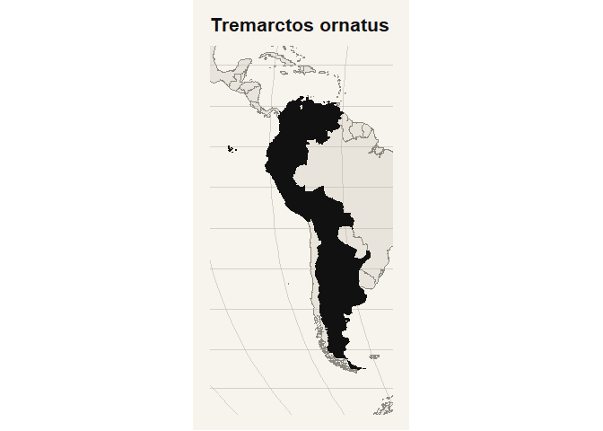
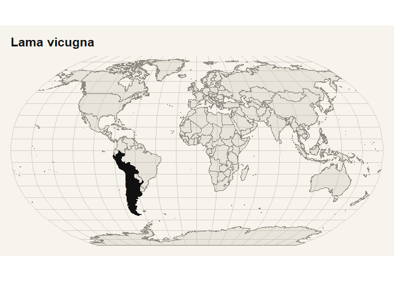
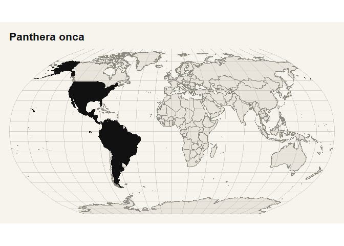

# rmdd

<!-- badges: start -->

[](https://lifecycle.r-lib.org/articles/stages.html#stable)
[](https://CRAN.R-project.org/package=rmdd)
[](https://cran.r-project.org/package=rmdd)
[](https://cran.r-project.org/package=rmdd)
<!-- badges: end -->

## Overview

`rmdd` is a tidyverse-style R package that wraps the **Mammal Diversity
Database (MDD v2.4)**, the authoritative taxonomic checklist maintained
by the American Society of Mammalogists. The package bundles the
complete MDD release as ready-to-use tibbles and provides a multi-stage
name reconciliation pipeline to resolve mammal scientific names —
including synonyms, original combinations, and typographic variants —
against the current accepted taxonomy.

The MDD currently covers **6,871 mammal species** (6,758 living wild +
113 recently extinct post-1500 CE), with over **64,683 synonymous
names** curated across 27 orders, 167 families, and 1,360 genera.

------------------------------------------------------------------------

## Installation

``` r
# Install from CRAN:
install.packages("rmdd")

# Install the development version from GitHub:
# install.packages("pak")
pak::pak("PaulESantos/rmdd")
```

------------------------------------------------------------------------

## Bundled datasets

`rmdd` ships three datasets that are loaded lazily and available
immediately after `library(rmdd)`:

| Dataset | Rows | Description |
|----|----|----|
| `mdd_checklist` | 6,871 | Species-level checklist with 52 variables (taxonomy, distribution, IUCN status, type locality, cross-release flags) |
| `mdd_synonyms` | ~64,683+ | Nomenclatural synonym table with 44 variables linking every known name combination to its accepted species |
| `mdd_type_specimen_metadata` | 138 | Institutional metadata for natural history collections cited in the synonym table |

All column names are normalized from the original camelCase to
`snake_case` on import. The original column names are documented in the
help pages for each dataset.

------------------------------------------------------------------------

## Core functions

### Name reconciliation

``` r
library(rmdd)

# Reconcile a vector of names against MDD
mdd_matching(c("Puma concolor", "Felis concolor", "Pumma concolor"))
#> # A tibble: 3 × 51
#>   input_index input_name     orig_name     orig_genus orig_subgenus orig_species
#>         <int> <chr>          <chr>         <chr>      <chr>         <chr>       
#> 1           1 Puma concolor  Puma concolor Puma       <NA>          concolor    
#> 2           2 Felis concolor Felis concol… Felis      <NA>          concolor    
#> 3           3 Pumma concolor Pumma concol… Pumma      <NA>          concolor    
#> # ℹ 45 more variables: orig_subspecies <chr>, author <chr>,
#> #   matched_name_id <chr>, matched_name <chr>, matched_author <chr>,
#> #   taxon_status <chr>, accepted_id <chr>, accepted_name <chr>,
#> #   accepted_author <chr>, is_accepted_name <lgl>, matched <lgl>,
#> #   match_stage <chr>, direct_match <lgl>, genus_match <lgl>,
#> #   fuzzy_match_genus <lgl>, direct_match_species_within_genus <lgl>,
#> #   fuzzy_match_species_within_genus <lgl>, fuzzy_genus_dist <dbl>, …

# Retrieve full structured information for a taxon
mdd_taxon_info("Vicugna vicugna")
#> 
#> ── Lama vicugna ────────────────────────────────────────────────────────────────
#> Query: "Vicugna vicugna"
#> Matched name: "Vicugna vicugna" (synonym)
#> Taxon URL: <https://www.mammaldiversity.org/taxon/1006388/>
#> • Common name: "Vicuña"
#> • Authority: "G. I. Molina 1782"
#> • Order / Family: "Artiodactyla / Camelidae"
#> • IUCN / Extinct / Domestic: "LC (as Vicugna vicugna) / 0 / 0"
#> • Synonym records: 27
#> 
#> ── Taxonomy ──
#> 
#> • Subclass: "Theria"
#> • Infraclass: "Placentalia"
#> • Magnorder: "Boreoeutheria"
#> • Superorder: "Laurasiatheria"
#> • Order: "Artiodactyla"
#> • Suborder: "Tylopoda"
#> • Family: "Camelidae"
#> • Subfamily: "Camelinae"
#> • Tribe: "Lamini"
#> • Genus: "Lama"
#> • Specific epithet: "vicugna"
#> • Sci name: "Lama vicugna"
#> 
#> ── Authority ──
#> 
#> • Authority species author: "G. I. Molina"
#> • Authority species year: "1782"
#> • Authority parentheses: "1"
#> • Original name combination: "Camellus Vicugna"
#> • Authority species citation: "Molina, G.I. 1782. Saggio sulla storia naturale
#> del Chili. S. Tommaso d'Aquino, Bologna, 367 pp."
#> • Authority species link: "https://bibdigital.rjb.csic.es/idurl/1/9635"
#> • Nominal names: "vicugna (G. I. Molina, 1782)|vicunna (G. Cuvier, 1797)
#> [incorrect subsequent spelling]|vicunna Tiedemann, 1808 [unjustified
#> emendation]|vicuna (Illiger, 1815) [nomen nudum]|viconnia (Desmoulins, 1823)
#> [unjustified emendation]|vicugna Lesson, 1842 [not published with a generic
#> name]|vicunia (von Tschudi, 1844) [unjustified emendation]|vicuna (Schmarda,
#> 1853) [incorrect subsequent spelling]|frontosa (H. F. P. Gervais & F. Ameghino,
#> 1880)|gracilis (H. F. P. Gervais & F. Ameghino, 1880)|lujanensis (F. Ameghino,
#> 1889)|promesolithica (F. Ameghino, 1889)|azarae (F. P. Moreno & Mercerat,
#> 1891)|minuta (Burmeister, 1891)|pristina (F. Ameghino, 1891)|mensalis O.
#> Thomas, 1917|provicugna (Boule & Thevenin, 1920)|elfridae Krumbiegel, 1944"
#> • Synonym count: "27"
#> 
#> ── Type information ──
#> 
#> • Type voucher: "untraced (number not known)"
#> • Type kind: "nonexistent"
#> • Type locality: "Chile, \"abondano nella parte della Cordigliera spettante
#> alle Provincie de Coquimbo, e di Copiapó\" (Cordilleras of Coquimbo and Copiapó
#> in northern Chile)."
#> 
#> ── Distribution ──
#> 
#> • Country distribution: "Peru|Bolivia|Chile|Argentina"
#> • Continent distribution: "South America"
#> • Biogeographic realm: "Neotropic"
#> 
#> ── Status ──
#> 
#> • Main common name: "Vicuña"
#> • Other common names: "Argentine Vicuña|Peruvian Vicuña"
#> • Iucn status: "LC (as Vicugna vicugna)"
#> • Extinct: "0"
#> • Domestic: "0"
#> • Flagged: "0"
#> • Diff since cmw: "1"
#> • Msw3 matchtype: "sciname match"
#> • Diff since msw3: "0"
#> 
#> ── Names and Synonyms ──
#> 
#> # A tibble: 8 × 3
#>   synonym          validity nomenclature_status          
#>   <chr>            <chr>    <chr>                        
#> 1 Camellus Vicugna species  available                    
#> 2 Camelus Vicugna  synonym  name_combination             
#> 3 Camelus vicunna  synonym  incorrect_subsequent_spelling
#> 4 Lacma vicunna    synonym  unjustified_emendation       
#> 5 Auchenia Vicuña  synonym  nomen_nudum                  
#> 6 Auchenia Vicunna synonym  name_combination             
#> 7 Lama vicugna     synonym  name_combination             
#> 8 auchenia vicugna synonym  name_combination
#> ... and 19 more synonym records
```

The reconciliation pipeline in `mdd_matching()` follows a waterfall of
five stages, moving from strict to relaxed evidence:

1.  **Direct match** — exact match on the cleaned full name or genus +
    epithet pair
2.  **Exact genus** — genus found in the MDD, regardless of species
3.  **Fuzzy genus** — genus matched by string distance (OSA by default,
    configurable)
4.  **Exact species within matched genus** — species epithet matched
    exactly within the resolved genus
5.  **Fuzzy species within matched genus** — species epithet matched by
    string distance

Every row in the output carries a `match_stage` label, pathway flags
(`direct_match`, `fuzzy_match_genus`, …), fuzzy distance columns, and
the full accepted-name context (`accepted_id`, `accepted_name`,
`accepted_author`).

### Parsing and classification

``` r
# Parse a vector of names into taxonomic components
classify_mammal_names(c(
  "Puma concolor",
  "Capromys (Pygmaeocapromys) angelcabrerai",
  "Mus musculus domesticus"
))
#> # A tibble: 3 × 15
#>   sorter input_name           orig_name orig_name_clean orig_genus orig_subgenus
#>    <dbl> <chr>                <chr>     <chr>           <chr>      <chr>        
#> 1      1 Puma concolor        Puma con… puma concolor   Puma       <NA>         
#> 2      2 Capromys (Pygmaeoca… Capromys… capromys (pygm… Capromys   Pygmaeocapro…
#> 3      3 Mus musculus domest… Mus musc… mus musculus d… Mus        <NA>         
#> # ℹ 9 more variables: orig_species <chr>, orig_subspecies <chr>, author <chr>,
#> #   rank <dbl>, has_cf <lgl>, has_aff <lgl>, is_sp <lgl>, is_spp <lgl>,
#> #   had_hybrid <lgl>


mdd_matching("Cricetus cricetus")
#> # A tibble: 1 × 51
#>   input_index input_name        orig_name  orig_genus orig_subgenus orig_species
#>         <int> <chr>             <chr>      <chr>      <chr>         <chr>       
#> 1           1 Cricetus cricetus Cricetus … Cricetus   <NA>          cricetus    
#> # ℹ 45 more variables: orig_subspecies <chr>, author <chr>,
#> #   matched_name_id <chr>, matched_name <chr>, matched_author <chr>,
#> #   taxon_status <chr>, accepted_id <chr>, accepted_name <chr>,
#> #   accepted_author <chr>, is_accepted_name <lgl>, matched <lgl>,
#> #   match_stage <chr>, direct_match <lgl>, genus_match <lgl>,
#> #   fuzzy_match_genus <lgl>, direct_match_species_within_genus <lgl>,
#> #   fuzzy_match_species_within_genus <lgl>, fuzzy_genus_dist <dbl>, …
```

### Distribution analysis

``` r
# Country-level mammal diversity summary
mdd_distribution_summary(level = "country")
#> # A tibble: 242 × 7
#>    region    orders families genera living_species extinct_species total_species
#>    <chr>      <int>    <int>  <int>          <int>           <int>         <int>
#>  1 Indonesia     17       58    241            793               4           797
#>  2 Brazil        11       51    250            785               3           788
#>  3 China         12       56    259            746               0           746
#>  4 Mexico        12       45    205            585               4           589
#>  5 Peru          13       55    229            582               0           582
#>  6 Colombia      13       51    213            532               0           532
#>  7 Democrat…     15       55    208            510               0           510
#>  8 United S…      9       41    164            488               3           491
#>  9 Ecuador       13       51    202            454               0           454
#> 10 India         12       51    202            438               0           438
#> # ℹ 232 more rows

# Continent-level, excluding domesticated species
mdd_distribution_summary(
  level = "continent",
  exclude_domesticated = TRUE
)
#> # A tibble: 7 × 7
#>   region     orders families genera living_species extinct_species total_species
#>   <chr>       <int>    <int>  <int>          <int>           <int>         <int>
#> 1 Asia           15       75    494           2157              11          2168
#> 2 Africa         15       80    395           1624               9          1633
#> 3 South Ame…     14       62    363           1598               9          1607
#> 4 North Ame…     12       63    325           1096              41          1137
#> 5 Oceania (…     11       44    200            738              42           780
#> 6 Europe          6       38    129            324               2           326
#> 7 Antarctica      2        8     19             27               0            27

# Distribution map (requires rnaturalearth + rnaturalearthdata)
mdd_distribution_map("Tremarctos ornatus", zoom = "auto")
#> 
#> ── Distribution Map ──
#> 
#> ✔ Exact input match: "Tremarctos ornatus"
#> ℹ Accepted taxon used for mapping: "Tremarctos ornatus"
#> ℹ Zoom mode: "auto"
#> ✔ Mapped 6 of 6 distribution units.
```

<!-- -->

``` r
mdd_distribution_map("Lama vicugna", quiet = TRUE)
```

<!-- -->

### Data citations

``` r
# Formatted MDD dataset citation
mdd_reference()
#> 
#> ── MDD Citation ──
#> 
#> Mammal Diversity Database. (2026). Mammal Diversity Database (Version 2.4)
#> [Data set]. Zenodo. https://doi.org/10.5281/zenodo.17033774
#> DOI: <https://doi.org/10.5281/zenodo.17033774>
```

------------------------------------------------------------------------

## Example workflow

``` r
library(rmdd)
library(tidyverse)
#> ── Attaching core tidyverse packages ──────────────────────── tidyverse 2.0.0 ──
#> ✔ dplyr     1.2.1     ✔ readr     2.2.0
#> ✔ forcats   1.0.1     ✔ stringr   1.6.0
#> ✔ ggplot2   4.0.2     ✔ tibble    3.3.1
#> ✔ lubridate 1.9.5     ✔ tidyr     1.3.2
#> ✔ purrr     1.2.2     
#> ── Conflicts ────────────────────────────────────────── tidyverse_conflicts() ──
#> ✖ dplyr::filter() masks stats::filter()
#> ✖ dplyr::lag()    masks stats::lag()
#> ℹ Use the conflicted package (<http://conflicted.r-lib.org/>) to force all conflicts to become errors

# 1. A list with spelling variants and synonyms
names_to_check <- c(
  "Panthera onca",
  "Felis onca",          # historical combination
  "Panthera onkca",      # typo
  "Lontra longicaudis",
  "Lutra longicaudis"    # synonym
)

# 2. Run the reconciliation pipeline
result <- mdd_matching(names_to_check, 
                       allow_duplicates = TRUE)
#> Warning: ! Multiple fuzzy matches for some species within genus (tied distances).
#> ℹ The first match is selected.

# 3. Inspect results
result |>
  select(input_name, matched_name, taxon_status,
         accepted_name, matched, match_stage)
#> # A tibble: 5 × 6
#>   input_name         matched_name taxon_status accepted_name matched match_stage
#>   <chr>              <chr>        <chr>        <chr>         <lgl>   <chr>      
#> 1 Panthera onca      Panthera on… accepted     Panthera onca TRUE    direct_mat…
#> 2 Felis onca         Felis onca   synonym      Panthera onca TRUE    direct_mat…
#> 3 Panthera onkca     Panthera on… accepted     Panthera onca TRUE    fuzzy_matc…
#> 4 Lontra longicaudis Lontra long… accepted     Lontra longi… TRUE    direct_mat…
#> 5 Lutra longicaudis  Lutra longi… synonym      Lontra longi… TRUE    direct_mat…

# 4. Full taxon profile for one species
mdd_taxon_info("Panthera onca")
#> 
#> ── Panthera onca ───────────────────────────────────────────────────────────────
#> Query: "Panthera onca"
#> Matched name: "Panthera onca" (accepted)
#> Taxon URL: <https://www.mammaldiversity.org/taxon/1006021/>
#> • Common name: "Jaguar"
#> • Authority: "Linnaeus 1758"
#> • Order / Family: "Carnivora / Felidae"
#> • IUCN / Extinct / Domestic: "NT / 0 / 0"
#> • Synonym records: 70
#> 
#> ── Taxonomy ──
#> 
#> • Subclass: "Theria"
#> • Infraclass: "Placentalia"
#> • Magnorder: "Boreoeutheria"
#> • Superorder: "Laurasiatheria"
#> • Order: "Carnivora"
#> • Suborder: "Feliformia"
#> • Infraorder: "Aeluroidea"
#> • Superfamily: "Feloidea"
#> • Family: "Felidae"
#> • Subfamily: "Pantherinae"
#> • Genus: "Panthera"
#> • Subgenus: "Jaguarius"
#> • Specific epithet: "onca"
#> • Sci name: "Panthera onca"
#> 
#> ── Authority ──
#> 
#> • Authority species author: "Linnaeus"
#> • Authority species year: "1758"
#> • Authority parentheses: "1"
#> • Original name combination: "Felis Onca"
#> • Authority species citation: "Linnaeus, C. 1758-01-01. Systema naturæ per
#> regna tria naturæ, secundum classes, ordines, genera, species, cum
#> characteribus, differentiis, synonymis, locis. Tomus I. Editio decima,
#> reformata. Laurentii Salvii, Stockholm, 823 pp."
#> • Authority species link: "https://www.biodiversitylibrary.org/page/25033834"
#> • Nominal names: "onca (Linnaeus, 1758)|nigra (Erxleben, 1777)|jaguara (G.
#> Forster, 1780) [nomen novum]|iaguar (Link, 1795) [nomen novum]|brasiliensis (H.
#> R. Schinz, 1821)|minor (J. B. Fischer, 1829)|major (J. B. Fischer,
#> 1830)|peruviana (de Blainville, 1843)|onza (von Tschudi, 1844) [incorrect
#> subsequent spelling]|hernandesii (J. E. Gray, 1858)|longifrons (Burmeister,
#> 1866)|alba Fitzinger, 1869 [infrasubspecific | preoccupied]|augusta (Leidy,
#> 1872)|jaguapara (Liais, 1872)|jaguarete (Liais, 1872)|jaguatyrica (Liais,
#> 1872)|palustris (F. Ameghino, 1888)|antiqua (F. Ameghino, 1889)
#> [preoccupied]|fossilis (F. Ameghino, 1889) [nomen novum |
#> preoccupied]|centralis (Mearns, 1901)|goldmani (Mearns, 1901)|goldmanni
#> (Trouessart, 1904) [incorrect subsequent spelling]|hernandezi (Trouessart,
#> 1904) [incorrect subsequent spelling]|proplatensis (F. Ameghino, 1904)|mexianae
#> (Hagmann, 1908)|onssa (von Ihering, 1911) [unjustified emendation]|notialis
#> (Hollister, 1914)|paraguensis (Hollister, 1914)|veronis (Hay, 1919)|ramsayi (F.
#> W. Miller, 1930) [nomen novum]|arizonensis (E. A. Goldman, 1932)|boliviensis
#> (E. W. Nelson & E. A. Goldman, 1933)|coxi (E. W. Nelson & E. A. Goldman,
#> 1933)|madeirae (E. W. Nelson & E. A. Goldman, 1933)|milleri (E. W. Nelson & E.
#> A. Goldman, 1933)|paulensis (E. W. Nelson & E. A. Goldman, 1933)|ucayalae (E.
#> W. Nelson & E. A. Goldman, 1933)|veraecrucis (E. W. Nelson & E. A. Goldman,
#> 1933)|andina Hoffstetter, 1952|jaguar (Cabrera, 1958) [incorrect subsequent
#> spelling]|gikdnabu Wozencraft, 2005 [nomen nudum | not used as
#> valid]|veraecruscis Wozencraft, 2005 [incorrect subsequent spelling]|hernandesi
#> D. E. Wilson & Mittermeier, 2009 [incorrect subsequent spelling]"
#> • Synonym count: "70"
#> 
#> ── Type information ──
#> 
#> • Type voucher: "untraced (number not known)"
#> • Type kind: "nonexistent"
#> • Type locality: "Pernambuco, Brazil."
#> 
#> ── Distribution ──
#> 
#> • Subregion distribution: "USA(AZ)"
#> • Country distribution: "United
#> States|Mexico|Guatemala|Belize|Honduras|Nicaragua|Costa
#> Rica|Panama|Colombia|Venezuela|Guyana|Suriname|French
#> Guiana|Ecuador|Peru|Brazil|Bolivia|Paraguay|Argentina"
#> • Continent distribution: "North America|South America"
#> • Biogeographic realm: "Nearctic|Neotropic"
#> 
#> ── Status ──
#> 
#> • Main common name: "Jaguar"
#> • Iucn status: "NT"
#> • Extinct: "0"
#> • Domestic: "0"
#> • Flagged: "0"
#> • Diff since cmw: "0"
#> • Msw3 matchtype: "sciname match"
#> • Diff since msw3: "0"
#> 
#> ── Names and Synonyms ──
#> # A tibble: 8 × 3
#>   synonym            validity nomenclature_status
#>   <chr>              <chr>    <chr>              
#> 1 Felis Onca         species  available          
#> 2 Felis nigra        synonym  available          
#> 3 Felis (Jaguara)    synonym  nomen_novum        
#> 4 Felis Iaguar       synonym  nomen_novum        
#> 5 Felix Onca         synonym  name_combination   
#> 6 Felis brasiliensis synonym  available          
#> 7 Felis Onca Minor   synonym  available          
#> 8 Felis Onca Major   synonym  available
#> ... and 62 more synonym records

# 5. Distribution map
mdd_distribution_map("Panthera onca", zoom = "auto")
#> 
#> ── Distribution Map ──
#> 
#> ✔ Exact input match: "Panthera onca"
#> ℹ Accepted taxon used for mapping: "Panthera onca"
#> ℹ Zoom mode: "world"
#> ✔ Mapped 18 of 19 distribution units.
#> Warning: 1 distribution unit could not be located in rnaturalearth.
#> ! 1 unit remains unresolved.
#> • "French Guiana"
```

<!-- -->

------------------------------------------------------------------------

## The Mammal Diversity Database

The MDD is maintained by the American Society of Mammalogists and tracks
all taxonomic changes to living and recently extinct mammal species
(post-1500 CE) in real time. The current release is **v2.4** (January 2,
2026).

Key MDD v2.4 statistics:

| Taxa                            | Count   |
|---------------------------------|---------|
| Total species                   | 6,871   |
| Living wild species             | 6,741   |
| Recently extinct (post-1500 CE) | 113     |
| Domestic species                | 17      |
| Genera                          | 1,360   |
| Families                        | 167     |
| Orders                          | 27      |
| Synonymous names                | 64,683+ |

The MDD v2 introduced geographic distribution codings at the country, US
state, continent, and biogeographic realm levels, a comprehensive
nomenclatural synonym dataset with type locality and specimen
information curated in coordination with
[Hesperomys](https://hesperomys.com) and
[Batnames](https://batnames.org), and a redesigned website with advanced
search and data visualization.

------------------------------------------------------------------------

## Citation

### Citing this package

``` r
citation("rmdd")
#> To cite rmdd in publications, please use:
#> 
#> To cite the rmdd package in publications, please use:
#> 
#>   Santos Andrade, P. E. (2026). rmdd: Mammal Diversity Database Tools
#>   for R. R package version 0.0.1. https://github.com/PaulESantos/rmdd
#> 
#> The mammal taxonomy bundled in this package is based on:
#> 
#>   Mammal Diversity Database. (2026). Mammal Diversity Database (Version
#>   2.4) [Data set]. Zenodo. https://doi.org/10.5281/zenodo.17033774
#> 
#>   Burgin, C. J., Zijlstra, J. S., Becker, M. A., Handika, H., Alston,
#>   J. M., Widness, J., Liphardt, S., Huckaby, D. G., and Upham, N. S.
#>   (2025). How many mammal species are there now? Updates and trends in
#>   taxonomic, nomenclatural, and geographic knowledge. Journal of
#>   Mammalogy, in press. https://doi.org/10.1101/2025.02.27.640393
#> 
#> To see these entries in BibTeX format, use 'print(<citation>,
#> bibtex=TRUE)', 'toBibtex(.)', or set
#> 'options(citation.bibtex.max=999)'.
```

### Citing the MDD dataset

    Mammal Diversity Database. (2026). Mammal Diversity Database (Version 2.4) [Data set].
    Zenodo. https://doi.org/10.5281/zenodo.17033774

Use `mdd_reference()` to generate a correctly formatted citation from
within R, including taxon-level entry citations when needed.

### Citing the MDD taxonomy (v2.0)

Burgin, C. J., Zijlstra, J. S., Becker, M. A., Handika, H., Alston, J.
M., Widness, J., Liphardt, S., Huckaby, D. G., and Upham, N. S. (2025).
How many mammal species are there now? Updates and trends in taxonomic,
nomenclatural, and geographic knowledge. *Journal of Mammalogy* in
press. <https://doi.org/10.1101/2025.02.27.640393>

### Citing the MDD taxonomy (v1.0)

Burgin, C. J., Colella, J. P., Kahn, P. L., and Upham, N. S. (2018). How
many species of mammals are there? *Journal of Mammalogy* 99: 1–11.
<https://doi.org/10.1093/jmammal/gyx147>

------------------------------------------------------------------------

## Related resources

- [MDD website](https://www.mammaldiversity.org/)
- [MDD Zenodo archive](https://doi.org/10.5281/zenodo.4139722)

------------------------------------------------------------------------

## Contributing and issues

Bug reports and feature requests are welcome at
<https://github.com/PaulESantos/rmdd/issues>.
